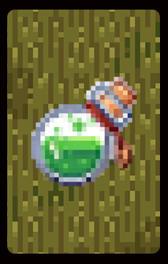
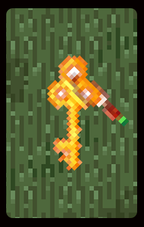
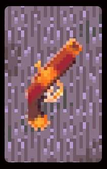

# :joystick: **CartagenaBuenaventura** :joystick:
Projeto integrador com fins educacionais: **sistema autônomo**, criar uma automatização que consiga jogar de maneira estratégica o jogo **Cartagena**. 
O nome do grupo se chama **Buenaventura**, nome de uma cidade na Colômbia dentro da temática do jogo.

&nbsp;

## 	:game_die: Cartagena 
Cartagena é um jogo de tabuleiro, onde o objetivo é levar todos os seus piratas da prisão até o barco (são 6 piratas).

### Regras 
- cada jogador começa com 6 cartas;
- em uma partida cada jogador terá seu turno para jogar os piratas, cada turno o jogador terá três ações;
- ações possíveis: mover um peão para frente, mover um peão para trás e pular a vez;
- mover para a frente: custa uma carta, e o peão irá se mover para próxima casa vazia com o mesmo símbolo que a carta. Se não tiver nenhuma casa de mesmo símbolo vazia, o peão chega no barco;
- mover para trás: sem custo, porém o pirata movido só pode se mover para uma casa que já tenha um ou dois piratas. O jogador ganha um número de cartas igual a quantidade de piratas que estava na casa;
- pular a vez: você não executa nenhuma ação dentro das suas 3 ações possíveis em seu turno, pode pular quantas vezes quiser e sem nenhum custo.

Para mais informações sobre o jogo [clique aqui](https://tablegames.com.br/wp-content/uploads/2017/10/cartagena_manual_table_games.pdf). 

&nbsp;

## :construction: Dados do jogo - Server 
A trilha que é disposta no tabuleiro, as cartas dos jogadores e histórico das jogados, todos esses dados do jogo, são guardados em um servidor. 
Em ``Classes > Services > Game.cs`` é possível encontrar métodos onde tratamos os retornos desse servidor.

:warning: ATENÇÃO: O servidor depois da data 12/06/2023 não estará funcionando, pois o trabalho já foi entregue, isso irá comprometer qualquer teste do programa.

&nbsp;

## :robot: Automação 
Nosso Robot ``Classes > Automation > Robot.cs`` é responsável por sempre verificar se é sua vez de jogar, chama alguma estratégia disponível em ``Classes > Automation > Strategies``. Porém, nota-se que é necessário para qualquer estratégia, que seja diposta a escolha, herdar ``Classes > Automation > Strategy.cs`` e implementar os métodos base de uma estratégia; dessa forma, ela poderá ser utilizada pelo Robot.

O Robot é chamado e utilizado no ``Forms > Board.cs`` onde está ocorrendo a partida dentro da nossa proposta de centralização de visualização do jogo.

### Estratégia adotada 
Durante a competição, a estratégia adotada foi a que chamamos de **Last Man Strategy**.

Ela leva em conta três critérios: a razão entre posição média dos peões do jogador pela média de todos os peões no tabuleiro, a quantidade de cartas disponíveis na mão do jogador e se existem oportunidades para avançar ou comprar cartas.

A estratégia adotada, busca preferencialmente avançar os ultimos peões e retornar os mais avançados no tabuleiro, para isso o algoritmo avalia as oportunidades e pondera qual é a melhor ação para o momento atual do tabuleiro.

&nbsp;

## 	:arrow_forward: Funcionamento 

> **Home**: Forms de entrada.

\
&nbsp;

> **Matches**: Forms para mostrar partidas. Possível: visualizar lobby, criar parta e entrar numa partida já existente.

\
&nbsp;

> **Lobby**: Forms de etapa antes de entrar em partida. Ou seja, é possível participar da partida, visualizar jogadores daquela partida, visualizar partida que está em progresso ou finalizada ou voltar para matches.

### até 5 jogares possíveis 

    
\
&nbsp;
\
&nbsp;

 
 

> **Board**: Forms onde é visualizada a partida, tanto o tabuleiro quanto as carta. Exemplo acima de um jogo com dois jogadores.

### 6 símbolos/cartas no jogo

     
\
&nbsp;
\
&nbsp;

> **Board**: Vitória do player2.

\
&nbsp;

